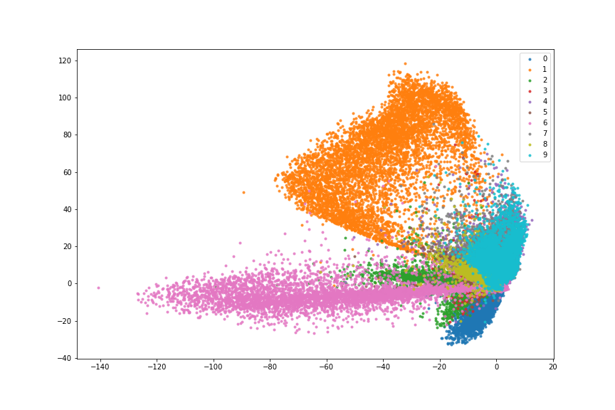
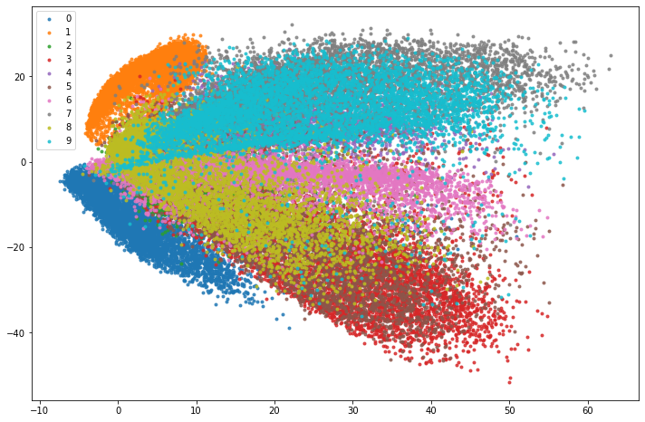
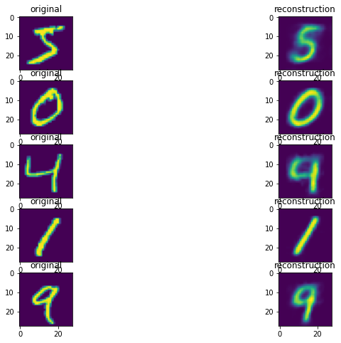

# Collection of Autoencoder Architectures

## Models (WIP)

- standard autoencoder
- variational autoencoder
- adversarial autoencoder

### Standard Autoencoder

unregularized two dimensional latent space:

### Adversarial Autoencoder

2D latent space regularized with 2D gaussian prior:

Sample reconstructions

