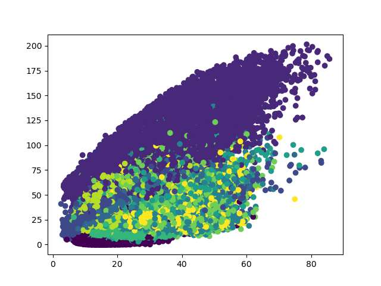
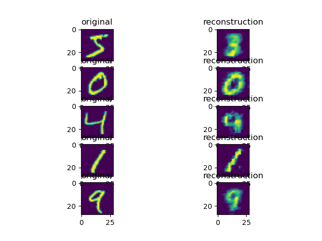

# Adversarial Autoencoder (Makhzani et al. (2016))

Autoencoder with two dimensional latent space trained on MNIST for the purpose of visualizing the effect of regularization on the latent space.

## Unregularized Autoencoder

Latent space of the unregularized autoencoder. True class labels are indicated by colours

Example reconstructions.
