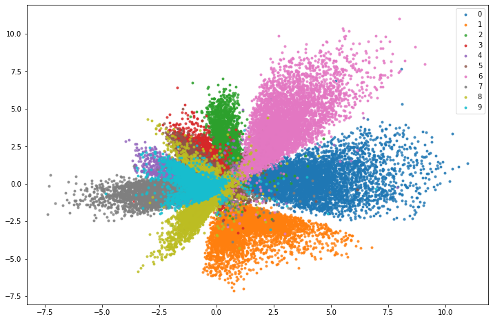

[#](#) Collection of Autoencoder Architectures

## Models (WIP)

- standard autoencoder
- variational autoencoder
- adversarial autoencoder

## Latent Space

unregularized two dimensional latent space:

2D latent space regularized with 2D gaussian prior:

